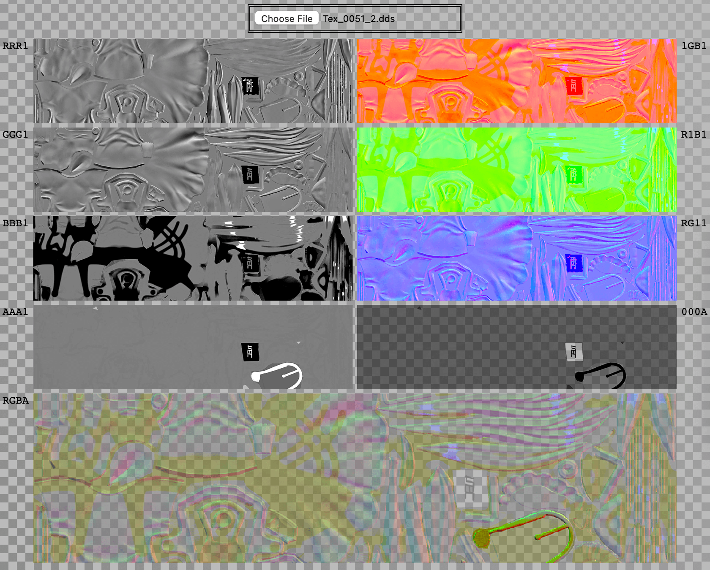

# RGBA Splitter

Splits an image into its red, green, blue, and alpha channels.

The results are displayed as HTML img elements, making them easy to save if needed.

Animated images are accepted as input, but only the first frame is shown in output.

DDS files are also accepted as input, but output is erroneous for a large portion of these files. (I wrote this website to analyze Ninja Ripper files, so a simple mipmap reader is all I needed.)

Note that color information may be missing in places where the alpha channel is zero. This is because input images are drawn on an HTML canvas in order to retrieve image data; this process discards transparent pixels. (DDS files do not have this problem, since image data is read directly from the file via DDSLoader instead.)
